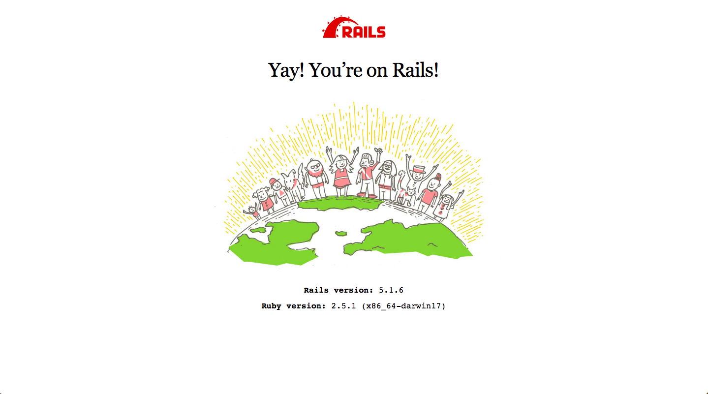
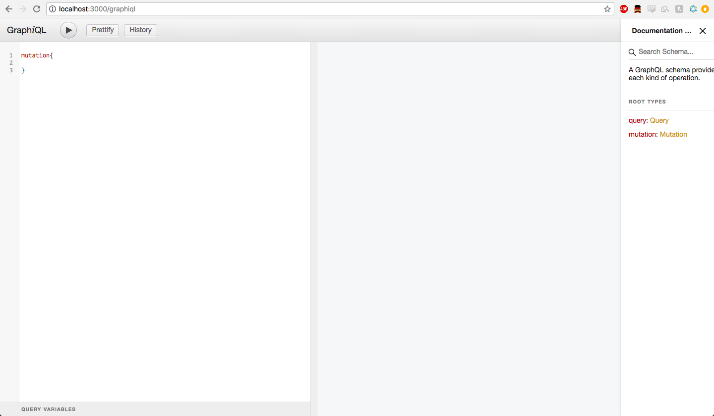
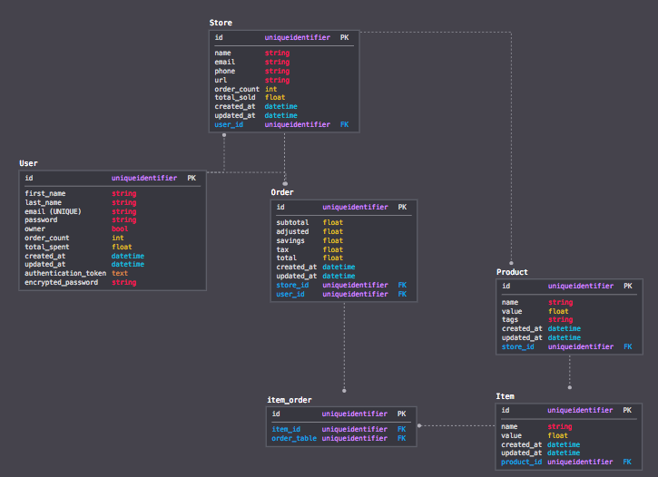
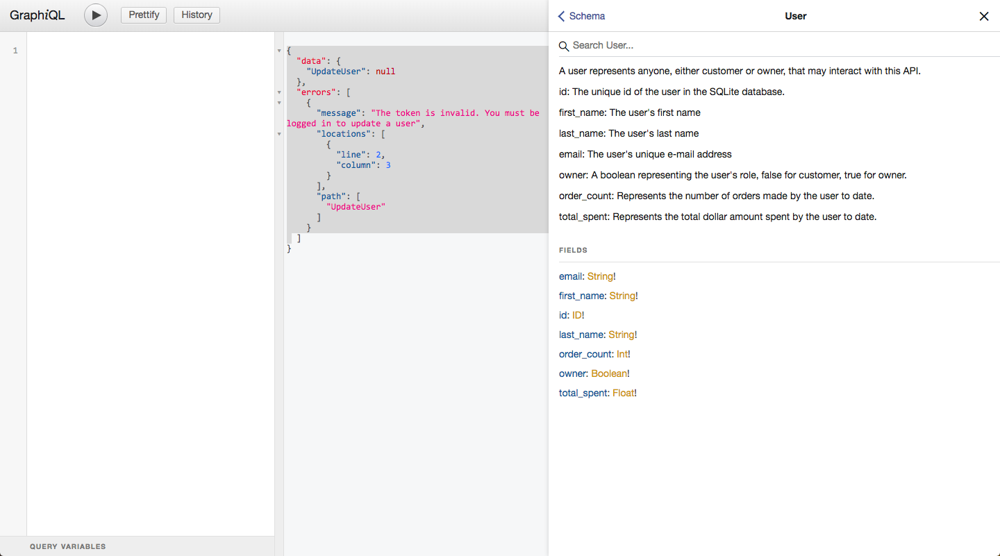
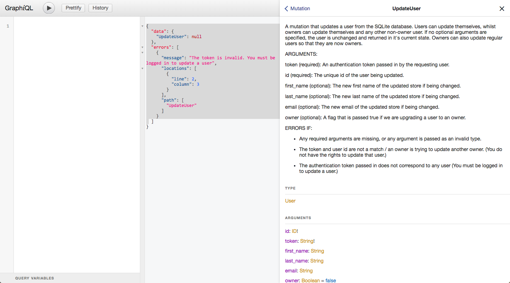
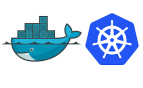

# Shopify Challenge 2019

## Table of Contents

- [Problem Requirements](#problem-requirements)
- [Context](#context)
  - [The Store](#the-store)
  - [Technologies Used](#technologies-used)
- [Getting Started / Launching](#getting-started)
- [My Api](#my-api)
  - [Seed Data](#seed-data)
- [Full CRUD Operations](#full-crud-operations)
  - [Queries](#queries)
  - [Mutations](#mutations)
- [Extended Functionality](#extended-functionality)
- [Security](#security)
  - [An Owner Can](#an-owner-can)
  - [A Regular User Can](#a-regular-user-can)
  - [Anybody Can](#anybody-can)
- [Documentation](#documentation)
- [Unit Testing](#unit-testing)
- [Kubernetes](#kubernetes)

## Problem Requirements

__Question 1__: Please design a server-side web API that models the following simple relationship:

- Shops have many Products
- Shops have many Orders
- Products have many Items
- Orders have many Items

(Items refer to any service or product added to an order, along with the quantity and price that pertain to them).

__Requirements per type__:

- Products, Items, and Orders all have a dollar value

- The value of an item should map to the value of the product that the item represents.

- The total value of an order should equal the sum of the value of it's items

__Extra Credit__:

- Supporting full CRUD operations
- Extending the base functionality in interesting ways
- Making your API at least partly secure
- Writing documentation that doesn't suck
- Building the API using GraphQL
- Unit testing

__Extra EXTRA credit__:
- Deploy the web API you have created to a Kubernetes environment that is publicly accessible.

## Context

#### The Store

Imagine for a moment, an apocalyptic future, one in which the various technologies developers and companies use to create software are no longer freely available on the web, but rather hidden behind pay-walls, and only downloadable upon purchase.

Gone are the days of enterprising young programmers toying around freely with the latest web framework, or hybrid mobile application SDK. Rather, there exists a number of authorized software distributors that sell  software to end-users at a price.

As horrible as this reality may seem to those of us with a passion for programming, my sample API is modeled in such a future, and around one such authorized software distributor:

_Peter's Programming Paradise_


At Peter's Programming Paradise, various software can be purchased, belonging to the following six categories:

- Mobile
- Web
- Front-end
- Database
- DevOps
- Text Editors/IDEs

In the original problem, it is stated that products have multiple items. I took this to mean that an individual item can represent a variation on the product that it maps to. For example, if a clothing store sold a certain jacket called _The Cool Jacket_, then _The Cool Jacket_ would be the product, and _The Cool Jacket (small)_ , _The Cool Jacket (medium)_, and _The Cool Jacket (large)_ could potentially represent the items that map onto the product.

In this case, since software typically doesn't come in different sizes and colours, line items represent the level of _service_ that Peter's Programming Paradise is willing to sell along with the base product. So, for example, if _Ruby on Rails_ was a web framework that the store offered, then _Ruby on Rails (base)_, _Ruby on Rails (+ 1 year service)_, and _Ruby on Rails (+ 2 year service)_ would represent the various items. In this case, service means that the staff of Peter's Programming Paradise will offer troubleshoot support, help with parsing documentation, and various customer forums where people can have their questions answered (think StackOverflow if it was hidden behind a pay-wall).

#### Technologies Used

For the purposes of this API, I decided to use Ruby on Rails, with the built-in SQLite database. I also used the ruby gem _graphiql_ to offer interactive documentation, but more on that later.

The reason behind choosing Ruby on Rails was simple. As someone who is very comfortable with writing servers using Node.js, the switch to Rails was quite seamless. Ruby is a language that was designed to be read human-first, machine-second, and as such doesn't boast some of the same idiosyncrasies that javascript has. And, as a framework, using Rails and the bundler to manage gem dependencies feels very similar to using npm. Rails keen focus on DRY, convention over implementation, and straight-forward usage of MVC architecture made it a delight to work with as someone with some prior exposure to Ruby via course-work.

Lastly, its important when applying for work to know your audience. Shopify is one of the largest applications in the world built on Rails, and have been a trailblazer as a company in showing the world the power of GraphQL as opposed to the classic REST Api implementation.

What I've discovered is that once you begin using GraphQL, it feels so natural. Long gone are the days of under or over-querying, and then installing some middleware or back-end logic to parse the data and hone in on what the client or end-user desires. With GraphQL, you can simply describe the data you wish to receive, receive it. It's incredibly easy, and satisfying.

[back to top](#table-of-contents)

## Getting Started

Before you've cloned this repo, you need to ensure that you have the Ruby programming language, as well as Rails and SQLite installed on your machine. Thankfully, [RailsInstaller](http://railsinstaller.org/en) is the quickest way to go from zero to developing Ruby on Rails applications. Regardless of the OS you are working on, follow the instructions at that web-page and you will be ready to work with this API in no time.

Once you have everything installed, simply clone the repo into a fresh directory and then navigate into it and run:

`bundle`

This will install all gem dependencies for this project. Once that is done, run the following two commands to migrate and seed the database with the default schema and records.

`rake db:migrate`
`rake db:seed`

Once this is done, simply fire up the server:

`rails s` or `rails server`

Once the server has started, you can navigate to the following url to ensure that it is working: `http://localhost:3000/`

You should see the following default Rails landing page, as a signal that the server is successfully running



Now, you should be able to navigate to the only other route the server is listening on, and that is `http://localhost:3000/graphiql`. This will expose the GraphiQL interactive IDE, which serves as both a hub for more in-depth documentation for the different operations that can be performed on the DB, but actually let us run them in the browser, and see the result in real-time. More on this in the !!!!documentation section of the README.



[back to top](#table-of-contents)

## My API

The way in which I decided to model the relations specified in the problem outline can be viewed in this SQL relation diagram.



Apart from showing you what some of the fields that different types have, the relationships shown in the diagram can also be explained as:

##### Store

  - A store has_many (0,...,n) products
  - A store has_many (0,...,n) orders
  - A store belongs_to (via foreign key) a User

#### User

  - A user has_many (0,...,n) orders
  - A user has_many (0,...,n) stores

#### Order

  - An order belongs_to (via foreign key) a user
  - An order belongs_to (via foreign key) a store
  - An order has_and_belongs_to_many (via a join table) items, this means that an order has many (1,...,n) items, and an item can belong to many (0,...,n) orders

#### Product

  - A product has_many (1,...,n) items
  - A product belongs_to (via foreign key) a store

#### Item

  - An item belongs_to (via foreign key) a product
  - An item has_and_belongs_to_many (via a join table) orders, this means that an order has many (1,...,n) items, and an item can belong to many (0,...,n) orders

As part of these relations, operations on certain records (a product for example) will also trigger operations on other records (the items that map onto that product for example), these will all be outlined below in the _Full Crud_ section of this README.

### Seed Data

My API is built to model the given relationships within the context of _Peter's Programming Paradise_.

The `db/seeds.rb` file need not be edited, it is set up to automatically look for all seed files in the `seeds` directory and run them alphabetically. For this reason, the naming convention for seed files should be kept as follows:

`a_seed.rb`
`b_seed.rb`
`c_seed.rb`

If you wish to deviate in order to specify what a seed is for, you can keep adhering to the style as such:

`d_special_user_seed.rb`

The seed data is set up such that there exists only the one store, with two default users; Peter, the owner of Peter's Programming Paradise, and an example customer. This is so that out-of-the-box we can test how the different user roles interact with the API.

As far as products, there exist 10 products in each of the 6 aforementioned categories, each with their own 3 item variations, following the style specified in this document. In order to see specifically what is being seeded, please visit the `b_seed.rb` [here](db/seeds/b_seed.rb)

[back to top](#table-of-contents)


## Full CRUD Operations

CRUD (Create, Read, Update, and Destroy) operations represent the different ways we can read and manipulate data within a database.

This particular API was built using GraphQL, which means that we can interact with our data via _Queries_ and _Mutations_. Both operations do what their name suggests, either query or mutate the data in some way.

Below is a brief overview of the different queries and mutations that can be made to the API. To read about them in more detail, visit the !!!! documentation section of this README and follow the instructions on how to view the API in _Graphiql_.

### Queries

#### stores

Queries the database for all records of type store. This query can be filtered by supplying various optional arguments such as store name, store email address, store order count etc.


#### users

Queries the database for all records of type user. This query can also be filtered by supplying various optional arguments such as user first name, last name, email address etc

_Only owners can query this API for users, more information on user roles can be found in the security section._

#### getMe

A query that takes in an `authentication_token` and returns the user that the token belongs to.


#### orders

Queries the database for all records of type order. This query can also be filtered by supplying various optional arguments such as user id, storeId, as well as how much orders cost.

_Only owners can query this API for orders, more information on user roles can be found in the security section._


#### products

Queries the database for all records of type product. This query can also be filtered by supplying various optional arguments such as name, value, tags, etc.

Querying for products can also return all of the item variations for that product. In this sense, this query serves both products and items, since GraphQL allows you to specify what fields you would like to query.


### Mutations

Below is a brief overview of the different mutations offered by this API. Most of these mutations are available only to owners and not to regular users. For more information on user roles, please visit the security section of this README.

#### createProduct

A mutation that creates a product by taking in as arguments various information that is required to create a Product record in the database.


#### updateProduct

A mutation that updates a product by taking in as arguments various information that is can be updated on a product in the database. If no changes are specified, simply returns the product in it's unaltered form.

#### deleteProduct

A mutation that allows for a product and it's item variations to be deleted from the database.


#### createItem

A mutation that creates an item by taking as arguments the information required to create an Item record in the database.

#### updateItem

A mutation that updates an item by taking as arguments various information that can be updated on an item. If no changes are specified, simply returns the item in it's unaltered form.

#### deleteItem

A mutation that allows for an individual item to be deleted from the database.


#### createUser

A mutation that creates a user by taking in as arguments the information required to create a user record. Created users can either be owners, or regular users, the same mutation is used in both cases.


#### SignInUser

A mutation that takes in a user's email and password and attempts to log them in, if successful, it returns that user's authentication_token to allow the client to pass it back when making other requests


#### UpdateUser

A mutation that updates a user by taking in different optional arguments representing the different information that can be changed about a user in the DB. If no changes are specified, the unaltered user is returned

#### DeleteUser

A mutation that allows a user record to be deleted from the database. If a user is deleted, all of that user's orders will be deleted. Additionally, if that user is an owner of a store, that store will be deleted.


#### createOrder

A mutation that takes in a store's id, a user's id, as well as a list of item ids, and creates an order for that user from that store with those items. Additionally, users can optionally passs in a coupon to try and earn savings, but this will be covered in the  !!!! _extended functionality_ section of the README.

Note that creating an order also populates the order/item join table with records for each item in that order.

##### deleteOrder

A mutation that deletes an order from the database and updates the relevant store and user to reflect the deletion of that order. Note that if an order is deleted, all entries in the join table pertaining to that order will also be deleted.

#### updateStore

A mutation that allows information such as the store's name, email, url, phone number and even owner to update. Note that only the store's specific owner, not anyone with owner privileges can update the store.

#### deleteStore

A mutation that allows a store to be deleted from the databae. Please note this will also delete all orders and products that belong to this store.


#### Missing CRUD operations

The two missing CRUD operations are _updateOrder_ and _createStore_. The reasons for these are simple. Although the logic for this API would easily be expandable to allow for multiple stores, I wanted to keep the scope of this example within the one store. As far as _updateOrder_ is concerned, it struck me that in most cases, once you have made an online order, updating that would be requesting a refund, in which case this is covered by deletion. However, you could potentially allow for users to modify orders within a certain time frame in case of sales, new coupons or other such promotions.

[back to top](#table-of-contents)


## Extended Functionality

I elected to extend the base functionality in a few ways that I believe make sense for an e-commerce platform. The first is through a few sales that _Peter's Programming Paradise_ is having:

1. For a limited time, you can use the coupon code `intern-dreams` to gain 10% off of your purchase.

2. As a back-to-school sale, if your order includes at least one item from each of the available item types:

  - Mobile
  - Web
  - Front-end
  - Database
  - DevOps
  - Text Editors/IDEs

You will receive 10% off of your purchase, AND all text editors / IDEs in your order are FREE!

What's more, is that these two offers are eligible to stack, meaning customers can receive a maximum of 20% off, and free text editors / IDEs on their order.

Additionally, stores and customers both track their order numbers and order totals. Through previous experience working at a small e-commerce business, I know first-hand how much loyal customers matter, as well as how business will often consider a customer's purchase history when making customer service decisions. Through tracking this, the door is left open for the API to be improved upon, by offering special deals to customers who spend over a certain threshold.

[back to top](#table-of-contents)

## Security

There are three main ways that I have secured the API that I have created:

1. __Input Validation__. All input parameters are checked for type and validity. For example, users can not be created with duplicate emails, items can not be created that are LESS expensive than the product they map on to, all types are checked etc.

2. __Error Handling__. Using GraphQL Execution Errors, the API is able to gracefully make the user aware of what went wrong with an improper query or mutation, as opposed to simply crashing during runtime. For example, if a user, if you try to update a user without providing a valid authentication token, the server returns the following:

```
{
  "data": {
    "UpdateUser": null
  },
  "errors": [
    {
      "message": "The token is invalid. You must be logged in to update a user",
      "locations": [
        {
          "line": 2,
          "column": 3
        }
      ],
      "path": [
        "UpdateUser"
      ]
    }
  ]
}
```

3. __User Roles__.


Using the devise gem, I made it so that my User model is token_authenticatable. Currently, tokens are set to expire every day, however this and other token settings can be changed in a config file [here](config/locales/token_authenticable.rb)

User roles are split between the following 3 roles:

- A regular user

- An owner

- The store's designated owner

The only difference between an owner and the store's designated owner is that the designated owner can change the store's name and update the store. The difference in responsibilities are as follows:

#### An owner can:

- Query anything

- Add, update, and delete items

- Add, update, and delete products

- Create a new user (either a regular user or an owner)

- Update themselves and other non-owner users

- Delete themselves and other non-owner users

- Create an order for themselves and other non-owner users

- Delete an order that belongs to themsleves or other non-owner users


#### A regular user can:

- Query products, items, stores, as well as themselves

- Create new regular user

- Update themselves

- Delete themselves

- Create orders for themselves


#### Anybody can

- Query products, items and stores

- Create a new regular user


#### A note about Tokens and Token Auth

Typically, tokens would be provided to the client on sign-in and then the client can include it in the header of further requests in order to authenticate.

My intention for this example API was for ALL mutations and queries to be testable from one end-point `http://localhost:3000/graphiql` using the Graphiql IDE. For this reason, the token has been included as a GraphQL request parameter, and is checked as such. If this server were to be integrated into a full-stack solution, the sign-in method would continue to provide the token on succecssful sign-in, and then instead of checking for it as a parameter, would check for it as a request header.

An important distinction between this example and a usual implementation of token authentication I wanted to point out.

[back to top](#table-of-contents)

## Documentation

Much like security, documentation (that doesn't suck) has been achieved via three methods:

1. __Extensive commenting in code__. All queries and mutations contain extensive commenting that clearly allows anyone with some programming experience, especially with Ruby on Rails / GraphQL to follow along comfortably.

2. __README__. This README aims to walk you through my thought process and implementation of the various requirements for this challenge. This includes the design of the relations between different items, the store itself, getting started using the API, and how to use Graphiql (below) to test in browser.

3. __Graphiql__. Graphiql is an interactive in-browser GraphQL IDE. This presents rich and robust documentation in a number of ways. Firstly, it allows anyone to test the various queries and mutations against the server and get results in real-time. Additionally, analogous to swagger-docs for REST servers, GraphQL features a _Documentation Explorer_, an extensive descriptions of the various queries and mutations, their arguments, and their return types. For example we can:

__search keywords to find types / arguments / queries or mutations__


__view specific types and learn more about them and their fields__



__view specific mutations or queries to learn about their arguments, return types and behaviours__


[back to top](#table-of-contents)


## Unit Testing

RSPEC

[back to top](#table-of-contents)


## Kubernetes



Deploying the API to a Kubernetes environment was originally the challenge I was going to tackle on the weekend preceding the closing of the application (22nd, 23rd of September). However, unfortunately, I, like many others in the Barrhaven (Ottawa) area have been affected by the blackout and have been without power since Friday afternoon. This has unfortunately been a great set-back and cost me key time this weekend with which I hoped to tackle this extra, extra credit assignment.

__However__, I will be attempting this step during the week to come, beyond the 24th when my application has been submitted, so please feel free to check back and view my progress! I will update this section with anything note-worthy.

[back to top](#table-of-contents)
